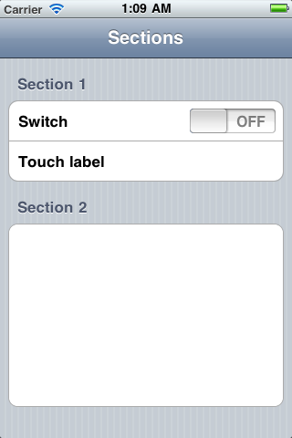

SectionsViewController
======================

A simplified UITableViewController interface usefull for simple or static table layouts.

Example usage
-------------

See

[SectionsViewControllerTest.m](SectionsViewControllerTest.m)
and
[SectionsViewControllerTest.h](SectionsViewControllerTest.h)
for example usage.

Will look like this:

